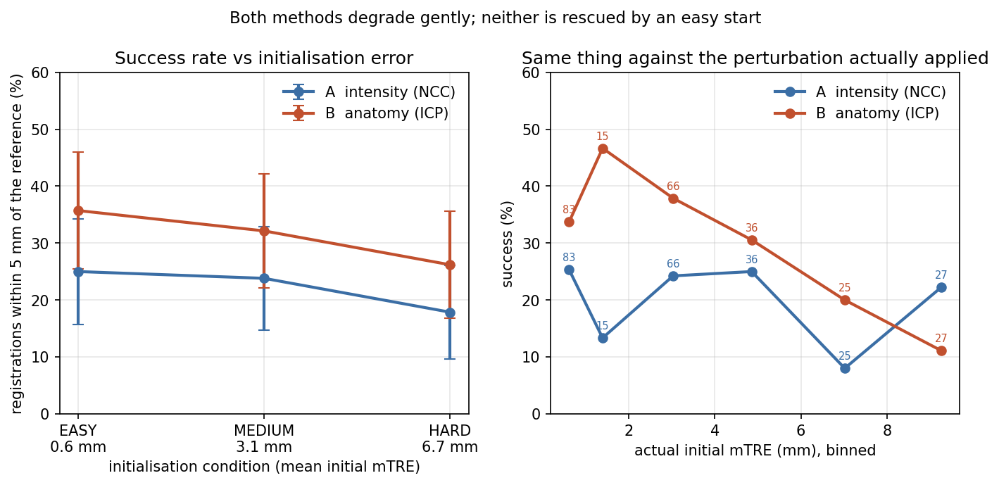
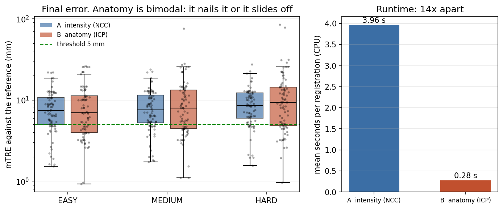
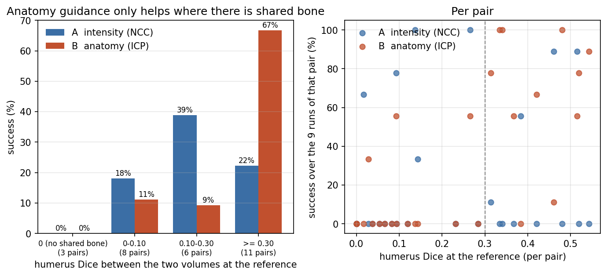
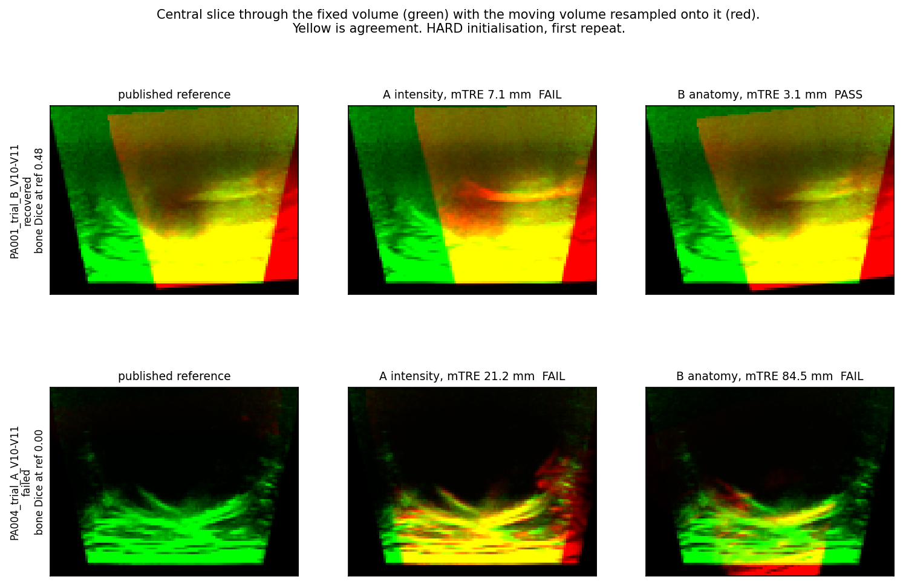
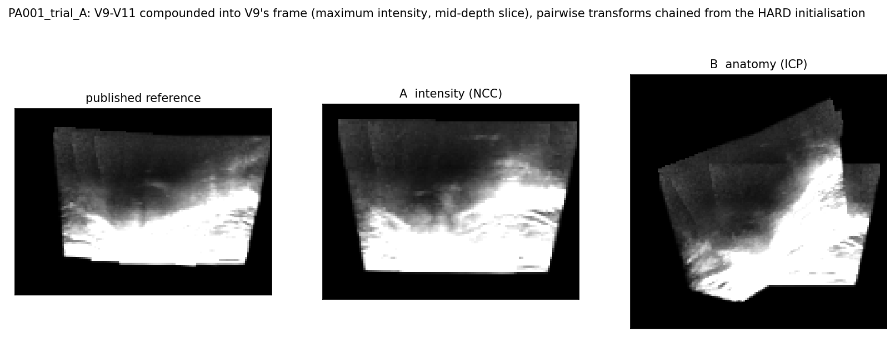
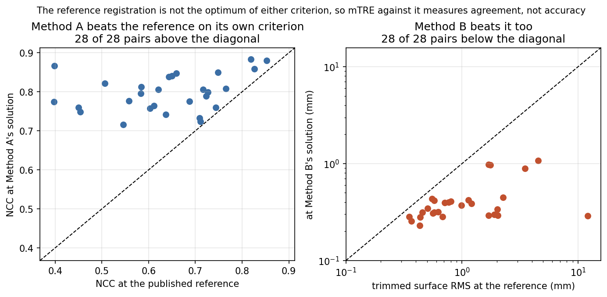

# Anatomy-Guided 3D Ultrasound Registration and Montaging

*A cross-anatomy study inspired by Zhang et al. (2026).*

Zhang et al. (2026) used anatomical boundary information to automate the
alignment and montaging of limited-field ocular ultrasound scans. This project
studies the same higher-level registration principle in a different anatomical
setting, using a public 3D shoulder-ultrasound dataset.

> **Research question.** Does explicit anatomy make ultrasound registration more
> robust to initialisation error than intensity-only alignment?

Everything below ran on CPU. The experiment itself takes **2.6 minutes**; the
whole pipeline from an empty checkout takes about 20 minutes, most of it
downloading. Every number is recomputed independently from the committed results
by [`final_audit.py`](final_audit.py).

```
   Zhang et al. 2026                        this project
   ─────────────────                        ────────────
   ocular ultrasound                        shoulder 3D ultrasound
        │                                        │
   anatomical retinal boundary              humerus bone surface
        │                                        │
   geometric alignment                      rigid registration
        │                                        │
   larger-field montage                     mosaic + robustness analysis
```

> **Scope.** This is a cross-anatomy study of a registration principle, not a
> reproduction. Different organ, different dataset, different evaluation. No
> claim is made that it reproduces Zhang et al., validates their ocular findings,
> or improves on their method.

**SAM is not carried over.** In the source work SAM is used *interactively* —
prompted inference, no training and no fine-tuning — so it is a way of obtaining
a boundary rather than the contribution itself. This dataset ships expert humerus
segmentations, so those are used.

---

## Method

Two methods estimate the same thing — a 6-DoF rigid transform placing one volume
in the other's frame — from the same byte-identical starting point, with the same
preprocessing. **Only the signal driving the alignment differs.**

```
              a pair of partially overlapping ultrasound volumes
                                 │
              ┌──────────────────┴──────────────────┐
              │                                     │
   A  INTENSITY                            B  ANATOMY
   NCC over the overlapping                humerus label map
   foreground                                   │
        │                                  marching cubes → surface points
   Nelder-Mead, 6-DoF rigid                     │
   coarse 1.0 mm → fine 0.5 mm             trimmed point-to-plane ICP, 6-DoF rigid
              │                                     │
              └──────────────────┬──────────────────┘
                                 │
                   mTRE against the published reference
```

**Method A** mirrors the automatic half of the source dataset's own pipeline —
their S1 Text specifies "Fast NCC ... optimised with the Nelder–Mead simplex
method". Their expert manual adjustment stage is not reproduced.

**Method B** extracts the humerus surface from the provided label maps by
marching cubes in physical coordinates, decimates to at most 5000 points, and
runs trimmed point-to-plane ICP keeping the closest 70 % of correspondences.

Volumes are resampled to isotropic *physical* spacing, not to a fixed cubic
array: the source voxels are anisotropic on a non-cubic grid, so forcing a cube
would distort the very geometry being measured.

Component-by-component attribution — what comes from Zhang et al., what from the
shoulder dataset, what is ours — is in
[`METHOD_TRACEABILITY.md`](METHOD_TRACEABILITY.md).

---

## Data

**Shoulder 3D Ultrasound Mosaicking Dataset**, Zenodo
[10.5281/zenodo.20283247](https://doi.org/10.5281/zenodo.20283247), CC BY 4.0.
Companion paper: Sewify et al., PLOS ONE, `10.1371/journal.pone.0347231`.

5 volunteers, 7 trials, 321 volumes of 512×403×256 at 0.110×0.107×0.240 mm,
62 humerus label maps, reference registrations, robot poses, MRI bone STLs.
No data is redistributed here; `download.py` fetches it from Zenodo.

**Only 1.7 GB of the 8.5 GB archive is downloaded.** The record is a single zip
and the experiment needs 62 of the 321 volumes, so `download.py` range-fetches
the zip's central directory, works out which members are needed, and pulls just
those. Every member is CRC-checked on arrival. `--full` gets the whole archive.

The dataset's refined transforms are used throughout as **published refined
reference registrations**. Agreement with them is not equivalent to physical
registration accuracy — a point this project measures rather than merely asserts,
below.

---

## Experimental design

For each eligible pair, the reference relative transform is corrupted by a known
random rigid perturbation and each method must recover it. This makes the target
exact by construction.

| condition | max translation | max rotation | mean initial mTRE |
|---|---|---|---:|
| EASY | 1 mm | 1° | 0.63 mm |
| MEDIUM | 5 mm | 5° | 3.09 mm |
| HARD | 10 mm | 10° | 6.67 mm |

3 deterministic seeds per (pair, condition); both methods receive the identical
perturbed start. **504 registrations over 28 pairs from 6 trials / 5
participants.**

Success is `mTRE < 5 mm`, written into
[`EXPERIMENT_PLAN.md`](EXPERIMENT_PLAN.md) before `register.py` existed and never
edited. Note the repository has a single initial commit, so the git history
cannot prove that ordering to a reader; the plan says so itself.

---

## Key results

### Aggregate comparison — mixed

| method | success rate | mean error vs reference | change from start | runtime |
|---|---:|---:|---:|---:|
| **A** intensity (NCC) | 22.2 % | **8.68 mm** | **+5.22 mm** | 3.96 s |
| **B** anatomy (ICP) | **31.3 %** | 10.59 mm | +7.13 mm | **0.28 s** |



The two columns point in opposite directions, and that is the actual finding, not
a reporting artefact. **ICP clears the 5 mm threshold more often and runs about
14× faster, but has a worse aggregate mean error, because when it fails it can
diverge strongly.** Its error distribution is bimodal; NCC's is not.

Under a bootstrap that resamples whole trials, the success-rate advantage is
**+9.1 points, 95 % CI [−6.2, +26.5]** — not distinguishable from zero with six
trials. The mean-error disadvantage, **+1.91 mm, 95 % CI [+0.41, +3.68]**, does
hold up.



### Exploratory overlap-stratified analysis

The failure analysis is where the behaviour becomes legible. Bone Dice at the
reference is a property of the *pair*, computed before either method ran, and is
never used to include or exclude anything.

| humerus Dice between the two volumes at the reference | pairs | A intensity | B anatomy |
|---|---:|---:|---:|
| 0 (no shared bone) | 3 | 0.0 % | 0.0 % |
| 0 – 0.10 | 8 | 18.1 % | 11.1 % |
| 0.10 – 0.30 | 6 | 38.9 % | 9.3 % |
| **≥ 0.30** | **11** | 22.2 % | **66.7 %** |



**This is an exploratory subgroup analysis**, not a pre-registered hypothesis
test. The high-overlap subgroup contains 11 pairs from a study of 6 trials, the
stratum boundaries were chosen after seeing the data, and no multiplicity
correction is applied. It is reported because it explains the bimodality, not as
a definitive statistical result.

### Qualitative



Top row: bone Dice 0.48, anatomy recovers to 3.1 mm while intensity slides to
7.1 mm. Bottom row: bone Dice 0.00, both fail and anatomy fails much worse
(84.5 mm).



Three volumes chained and compounded — the montage step in miniature.

---

## Interpretation

The aggregate comparison was mixed. Failure analysis showed that anatomy-guided
registration behaved very differently depending on whether the two acquisitions
actually contained enough common humerus surface. In the high-shared-anatomy
subset ICP achieved a substantially higher success rate, while its advantage
disappeared when anatomical overlap was weak.

So the transfer experiment suggests that **anatomy guidance shows a conditional
benefit: it is most useful when the overlapping acquisitions share sufficient
anatomical support.** In the eye, the retinal boundary is present in every
B-scan, so that support is essentially free. In the shoulder, a probe step of
about 3 cm means adjacent sweeps often image *different patches* of the humerus,
and the support has to be checked rather than assumed. This is an association
observed in 28 pairs, not a demonstrated causal mechanism.

### Both methods end further from the reference than they started

The `change from start` column above is positive for both methods at every
difficulty level. That looks alarming until the obvious alternative is tested:

| | at the published reference | at the method's own solution |
|---|---:|---:|
| mean NCC (Method A maximises this) | 0.6404 | **0.7977** |
| median trimmed surface RMS (Method B minimises this) | 0.785 mm | **0.3425 mm** |

Method A reaches a higher NCC than the reference on **28 of 28 pairs**; Method B
reaches a lower surface residual on **28 of 28**. Each optimiser is doing its job
— the published reference is simply not where either criterion peaks.



That is consistent with how the reference was produced: expert manual adjustment
guided by MRI bone segmentations, with groups of four neighbouring volumes
refined jointly under pose anchoring, rather than one pair at a time. A pairwise
automatic method has neither.

**Therefore mTRE here measures agreement with a particular high-quality
reconstruction, not physical registration accuracy**, and the tables should be
read comparatively. Detail: [`docs/reference_diagnostic.md`](docs/reference_diagnostic.md).

---

## Two data-handling decisions, validated externally

The dataset ships the authors' own per-pair Dice table, which makes it possible
to check our geometry against a number we did not produce.

**1. Coordinate convention of the reference transforms.** Under our coordinate
convention, the published transform parameters required inversion to reproduce
the geometry implied by the authors' reported overlap and Dice values:

| reading of the workbook parameters | correlation with their Dice | our mean Dice |
|---|---:|---:|
| as written | −0.03 | 0.001 |
| **inverted** | **+0.69** | 0.240 |
| inverted, Slicer-dialect pairs only | **+0.91** | 0.278 (theirs 0.347) |

Scanning all 45 possible row offsets on one pair gives a single unambiguous peak
at the correct row under the inverted reading and no peak under the literal one.
This is a statement about the convention our pipeline needs, not a claim that the
dataset is in error.

**2. Two MetaImage header dialects among the masks.** 43 label maps were written
by 3D Slicer and 19 by ImFusion, and the ImFusion ones carry a `Position` and
`Orientation` from the reconstructed scene rather than their own voxel grid.
**Those 19 segmentations could not be reconciled with the documented coordinate
conventions in our pipeline and were excluded from comparative evaluation** —
they reach only r = 0.60 against the published Dice, versus r = 0.91 for the
Slicer-written ones. This is what takes the pair count from 46 to 28. The
exclusion criterion is applied in `pairs.py`, recorded per pair in
`artifacts/pairs.json`, and evidenced in
[`docs/geometry_validation.md`](docs/geometry_validation.md).

---

## Limitations

1. **The reference is not ground truth.** It is a semi-automatic reconstruction
   with expert manual adjustment. The section above quantifies how far it sits
   from either automatic criterion.
2. **The reference was refined using bone.** MRI bone segmentations were the
   visual guide, so an anatomy-driven method is scored against a reference built
   with anatomical guidance. This favours Method B and is not corrected for.
3. **5 participants, 6 trials, 28 pairs.** Confidence intervals resample whole
   trials, and the headline success-rate difference does not clear zero.
4. **18 of 46 adjacent pairs were excluded** by the mask-dialect rule; one of
   them would also have gone for a degenerate reference (PA004_trial_A V9 and V10
   have byte-identical reference transforms). The pre-registered ≥ 15 % overlap
   rule excluded none — the smallest adjacent overlap is 51 %.
5. **Robot poses are unused.** Their relative rotations agree with the reference
   (r = 0.82 over 314 consecutive pairs) but their translations could not be
   reconciled under any of four obvious conventions, so the experiment uses
   controlled perturbations instead.
6. **Pairwise only.** The source pipeline refines four neighbouring volumes
   jointly with pose anchoring. Nothing here does.

Every deviation from the plan, including five of our own mistakes, is in
[`EXPERIMENT_DEVIATIONS.md`](EXPERIMENT_DEVIATIONS.md).

---

## Reproducing

```bash
pip install -r requirements.txt

python download.py          # ~1.7 GB from Zenodo, about 5 minutes
python audit.py             # checks the download against the dataset's own metadata
python validate_geometry.py # checks our geometry against the authors' Dice table
python preprocess.py        # resample + bone surfaces, about 5 minutes
python pairs.py             # apply the pre-registered pair rule
python run_experiment.py    # 504 registrations, about 3 minutes on 8 cores
python analyse.py
python diagnose_reference.py
python figures.py
python final_audit.py       # recomputes every headline number independently
python -m pytest tests/ -q
```

Current status: **`final_audit.py` PASS (26/26)**, **`pytest` 19 passed**,
**`audit.py` 11/11 with one documented discrepancy** (the MHD headers and the
PLOS ONE paper print different voxel spacings; the headers are used).

---

## Repository

| file | role |
|---|---|
| `config.py` | every threshold, spacing and seed, in one place |
| `download.py` | selective range download from the Zenodo zip |
| `data.py` | MetaImage reader, transform parsers, rigid maths |
| `preprocess.py` | isotropic resampling and bone-surface extraction |
| `pairs.py` | the pre-registered pair-selection rule |
| `perturb.py` | deterministic rigid perturbations |
| `register.py` | Method A and Method B |
| `metrics.py` | mTRE, Dice, NCC, cluster bootstrap |
| `run_experiment.py` | the experiment loop |
| `analyse.py`, `diagnose_reference.py`, `figures.py` | reporting |
| `audit.py`, `validate_geometry.py`, `final_audit.py` | the three checks |
| `EXPERIMENT_PLAN.md` | the design, written before implementation |
| `METHOD_TRACEABILITY.md` | which component came from where |
| `EXPERIMENT_DEVIATIONS.md` | every deviation, including our own mistakes |
| `docs/` | data audit, geometry validation, results, reference diagnostic |

`final_audit.py` recomputes the headline numbers from `artifacts/results.csv`
with its own code and does not import `metrics` or `analyse`, so a bug in those
cannot hide inside it.

---

## References

> Zhang Y, et al. *Automated Montaging of Ultrasound Scans for Extended-Range
> Imaging of the Posterior Eye.* Research Square preprint, 2026, CC BY 4.0.
> doi:10.21203/rs.3.rs-8835197/v1

> Sewify A, Steffens M, Perrier N, Antico M, Lavaill M, Edwards C, Pivonka P,
> Fontanarosa D. *Comprehensive reconstruction of the musculoskeletal anatomy in
> the shoulder using a hybrid 3D ultrasound mosaicking workflow: a pilot study.*
> PLOS ONE, 2026. doi:10.1371/journal.pone.0347231

> Shoulder 3D Ultrasound Mosaicking Dataset. Zenodo, CC BY 4.0.
> doi:10.5281/zenodo.20283247

Code in this repository is original and released under the MIT License
([`LICENSE`](LICENSE)). No dataset is redistributed.
